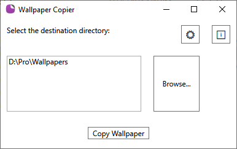
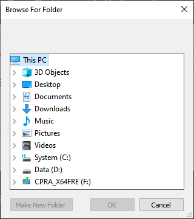
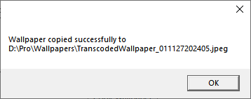
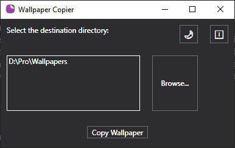

# Wallpaper Copier

Wallpaper Copier is a PowerShell script that creates a graphical user interface (GUI) to copy your Windows wallpaper to a selected directory with a unique filename. It supports both light and dark themes and saves user settings for convenience.

## Features

- **GUI with Light and Dark Mode**: Switch between light and dark themes with a simple button click.
- **Browse for Destination Directory**: Easily select a destination directory using a folder picker dialog.
- **Save User Settings**: Automatically saves the last used directory and theme.
- **Unique Filename Generation**: Ensures each copied wallpaper has a unique filename based on the date and time.
- **About Dialog**: Displays information about the application and its developer.

## Preview

### Main Window


### Browse Dialog


### Copy Operation


### Theme Switch


## Requirements

- PowerShell
- .NET Framework (required for WPF)
- `System.Windows.Forms` and `PresentationFramework` assemblies

## Usage

1. **Clone the Repository**:
    ```sh
    git clone https://github.com/OmniTx/WallpaperCopier.git
    cd WallpaperCopier
    ```

2. **Run the Script**:
    ```sh
    .\WallpaperCopier.ps1
    ```

3. **Convert to Executable (Optional)**:
    If you prefer to run the script as an executable, you can use `ps2exe` to convert it:
    ```sh
    ps2exe -noConsole -inputFile "WallpaperCopier.ps1" -outputFile "WallpaperCopier.exe"
    ```

## How to Use

1. **Open the Application**:
    Run the PowerShell script or executable to open the Wallpaper Copier window.

2. **Select Destination Directory**:
    Click the "Browse..." button to open the folder picker dialog. Select your desired destination directory and click "OK".

3. **Copy Wallpaper**:
    Click the "Copy Wallpaper" button to copy your current Windows wallpaper to the selected directory. The filename will be unique, ensuring no files are overwritten.

4. **Switch Theme**:
    Click the sun/moon icon to toggle between light and dark mode.

5. **About**:
    Click the info icon to view information about the application and its developer.

## Developer

- **Name**: ImranAh
- **Contact**: itsimran.official001@gmail.com
- **GitHub**: [OmniTx](https://github.com/OmniTx)

## License

This project is licensed under the MIT License. See the [LICENSE](LICENSE) file for details.

